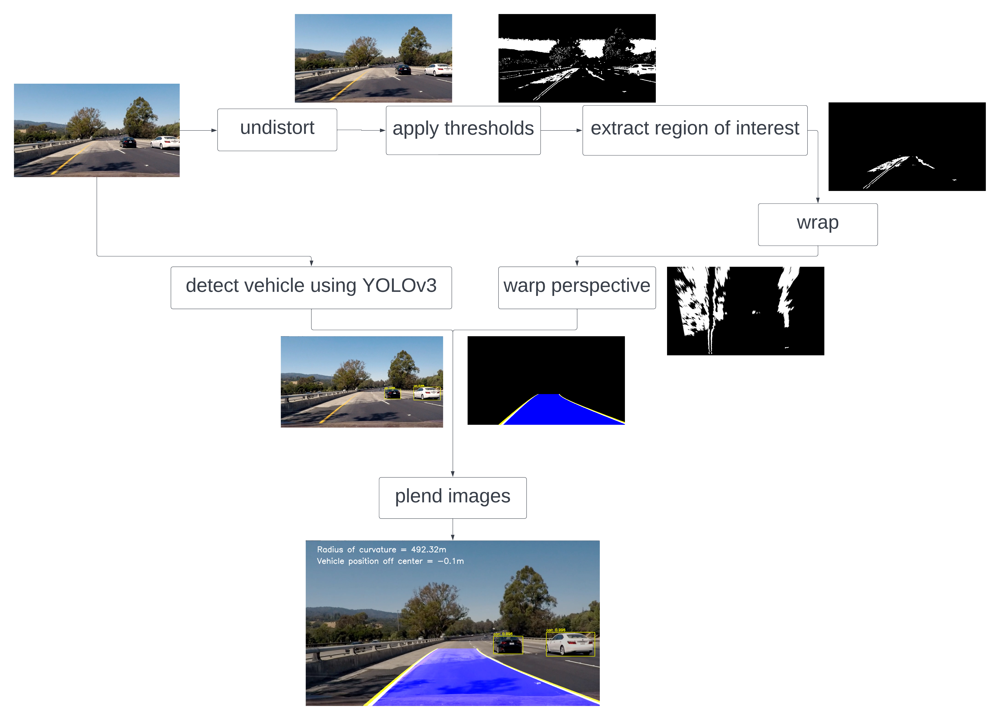

# Table of contents
* [General Info](#general-info)
* [System Pipeline](#system-pipeline)
* [Run](#run)


## General info
The project divided into two phases, For the first phase:
* The pipeline be able to detect the lanes, highlight them using a yellow color, and colour the
  area between them in blue.
* Display the estimatation of the vehicle position away from the center of the
  lane and the radius of curvature of the road as well.
</br>
For the second phase, we locate and identify the cars on the road using YOLOv3 and 
select the right bounding box using Non-Max Suppression.
</br>

## System Pipeline
<p align="center">
  
  <div align="center">The seven stages of our pipeline</div>
</p>

## Run
To run normal mode
```
chmod u+x run.sh
./run.sh <input_video>
```

To run in deubg mode
```
chmod u+x run.sh
./run.sh <input_video> deubg
```

| Output in Normal Mode | Output in Debug Mode|
| :-----------------------------------------------------------: | :-------------------------------------------------: |
| |  |


